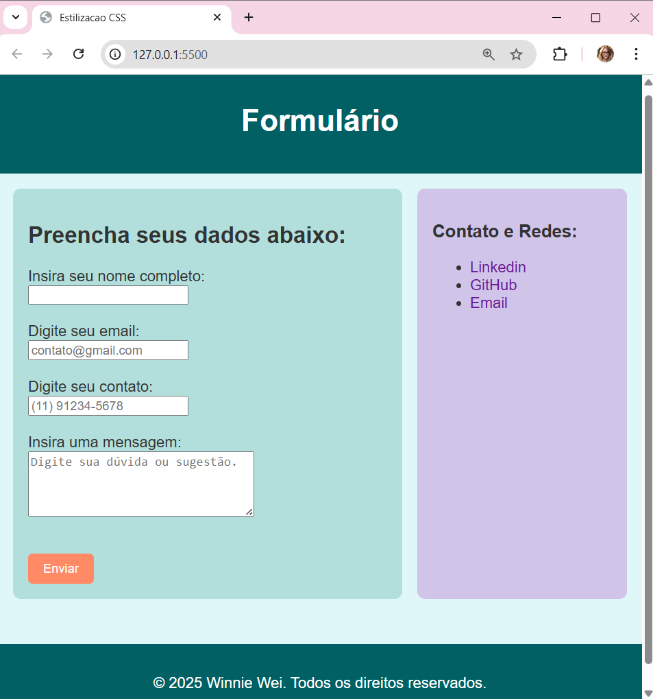

# AtividadeCSS

Foi criado um arquivo HTML com uma estrutura simples contendo header, section, aside, footer, e elementos como botões e links. 
E foi estilizado utilizando o CSS.

O resultado final do layout se encontra na imagem abaixo: 

